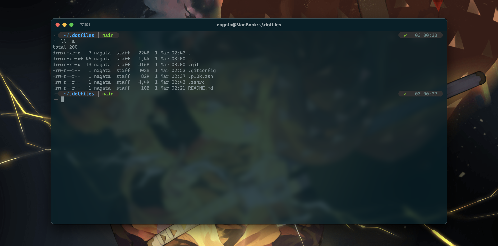

# dotfiles

```bash
# HomeBrew Install
/bin/bash -c "$(curl -fsSL https://raw.githubusercontent.com/Homebrew/install/HEAD/install.sh)"
```

```bash
# Git Install
brew install git
```

```bash
# iTerm2 Install
brew install iterm2 --cask
```

```bash
# Oh My ZSH Install
/bin/bash -c "$(curl -fsSL https://raw.githubusercontent.com/ohmyzsh/ohmyzsh/master/tools/install.sh)"
```

[Download Caskaydia Cove Nerd Font](https://www.nerdfonts.com/font-downloads)

```bash
# Clone Powerlevel10k Theme
cd ~ && git clone --depth=1 https://github.com/romkatv/powerlevel10k.git ${ZSH_CUSTOM:-$HOME/.oh-my-zsh/custom}/themes/powerlevel10k
```

```bash
# Setup dotfiles
git clone https://github.com/tiagomassashi/dotfiles.git ~/.dotfiles
cd ~/.dotfiles
ln -s ~/.dotfiles/.zshrc ~/.zshrc
ln -s ~/.dotfiles/.gitconfig ~/.gitconfig
ln -s ~/.dotfiles/.p10k.zsh ~/.p10k.zsh
```

```bash
# Eclipse preferences
cd ~/.dotfiles/eclipse/.settings
ln -s ~/.dotfiles/eclipse/.settings/org.eclipse.core.resources.prefs ~/workspace/.metadata/.plugins/org.eclipse.core.runtime/.settings/org.eclipse.core.resources.prefs
ln -s ~/.dotfiles/eclipse/.settings/org.eclipse.core.runtime.prefs ~/workspace/.metadata/.plugins/org.eclipse.core.runtime/.settings/org.eclipse.core.runtime.prefs
ln -s ~/.dotfiles/eclipse/.settings/org.eclipse.datatools.sqltools.sqledit ~/workspace/.metadata/.plugins/org.eclipse.core.runtime/.settings/org.eclipse.datatools.sqltools.sqledit
ln -s ~/.dotfiles/eclipse/.settings/org.eclipse.debug.ui.prefs ~/workspace/.metadata/.plugins/org.eclipse.core.runtime/.settings/org.eclipse.debug.ui.prefs
ln -s ~/.dotfiles/eclipse/.settings/org.eclipse.e4.ui.css.swt.theme.prefs ~/workspace/.metadata/.plugins/org.eclipse.core.runtime/.settings/org.eclipse.e4.ui.css.swt.theme.prefs
ln -s ~/.dotfiles/eclipse/.settings/org.eclipse.e4.ui.workbench.renderers. ~/workspace/.metadata/.plugins/org.eclipse.core.runtime/.settings/org.eclipse.e4.ui.workbench.renderers.
ln -s ~/.dotfiles/eclipse/.settings/org.eclipse.egit.core.prefs ~/workspace/.metadata/.plugins/org.eclipse.core.runtime/.settings/org.eclipse.egit.core.prefs
ln -s ~/.dotfiles/eclipse/.settings/org.eclipse.egit.ui.prefs ~/workspace/.metadata/.plugins/org.eclipse.core.runtime/.settings/org.eclipse.egit.ui.prefs
ln -s ~/.dotfiles/eclipse/.settings/org.eclipse.epp.mpc.ui.prefs ~/workspace/.metadata/.plugins/org.eclipse.core.runtime/.settings/org.eclipse.epp.mpc.ui.prefs
ln -s ~/.dotfiles/eclipse/.settings/org.eclipse.help.base.prefs ~/workspace/.metadata/.plugins/org.eclipse.core.runtime/.settings/org.eclipse.help.base.prefs
ln -s ~/.dotfiles/eclipse/.settings/org.eclipse.jdt.core.prefs ~/workspace/.metadata/.plugins/org.eclipse.core.runtime/.settings/org.eclipse.jdt.core.prefs
ln -s ~/.dotfiles/eclipse/.settings/org.eclipse.jdt.debug.ui.prefs ~/workspace/.metadata/.plugins/org.eclipse.core.runtime/.settings/org.eclipse.jdt.debug.ui.prefs
ln -s ~/.dotfiles/eclipse/.settings/org.eclipse.jdt.junit.prefs ~/workspace/.metadata/.plugins/org.eclipse.core.runtime/.settings/org.eclipse.jdt.junit.prefs
ln -s ~/.dotfiles/eclipse/.settings/org.eclipse.jdt.launching.prefs ~/workspace/.metadata/.plugins/org.eclipse.core.runtime/.settings/org.eclipse.jdt.launching.prefs
ln -s ~/.dotfiles/eclipse/.settings/org.eclipse.jdt.ui.prefs ~/workspace/.metadata/.plugins/org.eclipse.core.runtime/.settings/org.eclipse.jdt.ui.prefs
ln -s ~/.dotfiles/eclipse/.settings/org.eclipse.jst.j2ee.webservice.ui.pre ~/workspace/.metadata/.plugins/org.eclipse.core.runtime/.settings/org.eclipse.jst.j2ee.webservice.ui.pre
ln -s ~/.dotfiles/eclipse/.settings/org.eclipse.jst.jsp.core.prefs ~/workspace/.metadata/.plugins/org.eclipse.core.runtime/.settings/org.eclipse.jst.jsp.core.prefs
ln -s ~/.dotfiles/eclipse/.settings/org.eclipse.m2e.discovery.prefs ~/workspace/.metadata/.plugins/org.eclipse.core.runtime/.settings/org.eclipse.m2e.discovery.prefs
ln -s ~/.dotfiles/eclipse/.settings/org.eclipse.mylyn.context.core.prefs ~/workspace/.metadata/.plugins/org.eclipse.core.runtime/.settings/org.eclipse.mylyn.context.core.prefs
ln -s ~/.dotfiles/eclipse/.settings/org.eclipse.mylyn.java.ui.prefs ~/workspace/.metadata/.plugins/org.eclipse.core.runtime/.settings/org.eclipse.mylyn.java.ui.prefs
ln -s ~/.dotfiles/eclipse/.settings/org.eclipse.mylyn.monitor.ui.prefs ~/workspace/.metadata/.plugins/org.eclipse.core.runtime/.settings/org.eclipse.mylyn.monitor.ui.prefs
ln -s ~/.dotfiles/eclipse/.settings/org.eclipse.mylyn.tasks.ui.prefs ~/workspace/.metadata/.plugins/org.eclipse.core.runtime/.settings/org.eclipse.mylyn.tasks.ui.prefs
ln -s ~/.dotfiles/eclipse/.settings/org.eclipse.pde.api.tools.prefs ~/workspace/.metadata/.plugins/org.eclipse.core.runtime/.settings/org.eclipse.pde.api.tools.prefs
ln -s ~/.dotfiles/eclipse/.settings/org.eclipse.pde.core.prefs ~/workspace/.metadata/.plugins/org.eclipse.core.runtime/.settings/org.eclipse.pde.core.prefs
ln -s ~/.dotfiles/eclipse/.settings/org.eclipse.search.prefs ~/workspace/.metadata/.plugins/org.eclipse.core.runtime/.settings/org.eclipse.search.prefs
ln -s ~/.dotfiles/eclipse/.settings/org.eclipse.ui.browser.prefs ~/workspace/.metadata/.plugins/org.eclipse.core.runtime/.settings/org.eclipse.ui.browser.prefs
ln -s ~/.dotfiles/eclipse/.settings/org.eclipse.ui.ide.prefs ~/workspace/.metadata/.plugins/org.eclipse.core.runtime/.settings/org.eclipse.ui.ide.prefs
ln -s ~/.dotfiles/eclipse/.settings/org.eclipse.ui.navigator.prefs ~/workspace/.metadata/.plugins/org.eclipse.core.runtime/.settings/org.eclipse.ui.navigator.prefs
ln -s ~/.dotfiles/eclipse/.settings/org.eclipse.ui.prefs ~/workspace/.metadata/.plugins/org.eclipse.core.runtime/.settings/org.eclipse.ui.prefs
ln -s ~/.dotfiles/eclipse/.settings/org.eclipse.ui.workbench.prefs ~/workspace/.metadata/.plugins/org.eclipse.core.runtime/.settings/org.eclipse.ui.workbench.prefs
ln -s ~/.dotfiles/eclipse/.settings/org.eclipse.urischeme.prefs ~/workspace/.metadata/.plugins/org.eclipse.core.runtime/.settings/org.eclipse.urischeme.prefs
ln -s ~/.dotfiles/eclipse/.settings/org.eclipse.wst.css.ui.prefs ~/workspace/.metadata/.plugins/org.eclipse.core.runtime/.settings/org.eclipse.wst.css.ui.prefs
ln -s ~/.dotfiles/eclipse/.settings/org.eclipse.wst.html.ui.prefs ~/workspace/.metadata/.plugins/org.eclipse.core.runtime/.settings/org.eclipse.wst.html.ui.prefs
ln -s ~/.dotfiles/eclipse/.settings/org.eclipse.wst.jsdt.ui.prefs ~/workspace/.metadata/.plugins/org.eclipse.core.runtime/.settings/org.eclipse.wst.jsdt.ui.prefs
ln -s ~/.dotfiles/eclipse/.settings/org.eclipse.wst.jsdt.web.core.prefs ~/workspace/.metadata/.plugins/org.eclipse.core.runtime/.settings/org.eclipse.wst.jsdt.web.core.prefs
ln -s ~/.dotfiles/eclipse/.settings/org.eclipse.wst.sse.ui.prefs ~/workspace/.metadata/.plugins/org.eclipse.core.runtime/.settings/org.eclipse.wst.sse.ui.prefs
ln -s ~/.dotfiles/eclipse/.settings/org.eclipse.wst.ws.service.policy.pref ~/workspace/.metadata/.plugins/org.eclipse.core.runtime/.settings/org.eclipse.wst.ws.service.policy.pref
ln -s ~/.dotfiles/eclipse/.settings/org.eclipse.wst.xml.ui.prefs ~/workspace/.metadata/.plugins/org.eclipse.core.runtime/.settings/org.eclipse.wst.xml.ui.prefs
```

## How to extract current installed files?

```bash
cd ~/.dotfiles && brew bundle dump --force && git add . && git commit -m "file(Brewfile): update file" && git push
```
